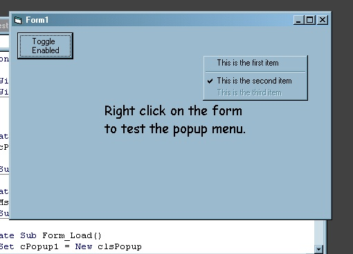

<div align="center">

## Simple API Popup Menu Class  \(for context menus on the fly\)


</div>

### Description

OK... not looking to blow away the world with this one, but felt lead to make the post after reading this article.

http://www.planet-source-code.com/vb/scripts/showcode.asp?txtCodeId=26999&lngWId=1

At work, I have an app that is an mdi based program... and while the sub forms don't need a menu bar of their own, they do need popup context menus. Since adding even an invisible menu to a mdichild form will cause it to over write the parent mdi's menu bar, I needed a way to create menus for the child forms on the fly.

This simple class demonstrates using the API calls to create a popup menu, display it, and return the item that was clicked (if any). It is simple and self-contained, but this will at least get you started on your way to wrapping the API menu functions in VB classes. I can already see I will be expanding this class, since getting this far was actually quite easy. The ultimate goal would be to "InsertMenuItem"s not just in a popup, but in the menu bar of the parent mdi form as well. I'll repost the class when I've taken it that far. (just updated to include .ItemEnabled property for the popup menu)
 
### More Info
 


<span>             |<span>
---                |---
**Submitted On**   |2001-09-07 00:06:46
**By**             |[TheFrogPrince](https://github.com/Planet-Source-Code/PSCIndex/blob/master/ByAuthor/thefrogprince.md)
**Level**          |Intermediate
**User Rating**    |4.9 (34 globes from 7 users)
**Compatibility**  |VB 6\.0
**Category**       |[Custom Controls/ Forms/  Menus](https://github.com/Planet-Source-Code/PSCIndex/blob/master/ByCategory/custom-controls-forms-menus__1-4.md)
**World**          |[Visual Basic](https://github.com/Planet-Source-Code/PSCIndex/blob/master/ByWorld/visual-basic.md)
**Archive File**   |[Simple API271949292001\.zip](https://github.com/Planet-Source-Code/thefrogprince-simple-api-popup-menu-class-for-context-menus-on-the-fly__1-27043/archive/master.zip)

### API Declarations

```
Private Declare Function GetCursorPos _
        Lib "user32" ( _
       lpPoint As POINTAPI) _
      As Long
Private Declare Function InsertMenuItem _
        Lib "user32.dll" _
        Alias "InsertMenuItemA" ( _
       ByVal hMenu As Long, _
       ByVal uItem As Long, _
       ByVal fByPosition As Long, _
       lpmii As MENUITEMINFO) _
      As Long
Private Declare Function CreatePopupMenu _
        Lib "user32" () _
      As Long
Private Declare Function TrackPopupMenu _
        Lib "user32" ( _
       ByVal hMenu As Long, _
       ByVal wFlags As enumTrackPopupMenu, _
       ByVal x As Long, _
       ByVal y As Long, _
       ByVal nReserved As Long, _
       ByVal hwnd As Long, _
       lprc As RECT) _
      As Long
Private Declare Function AppendMenu _
        Lib "user32" _
        Alias "AppendMenuA" ( _
       ByVal hMenu As Long, _
       ByVal wFlags As Long, _
       ByVal wIDNewItem As Long, _
       ByVal lpNewItem As Any) _
      As Long
Private Declare Function DestroyMenu Lib "user32" ( _
       ByVal hMenu As Long) _
      As Long
```


